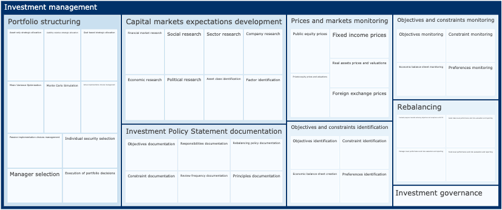

# Capability Models

Books, papers and texts published by a regulator are full of business capability models.

[CFA Reading 12 from Level III 2019](https://www.cfainstitute.org/en/programs/cfa/exam/level-iii) describes capabilities of an investment management firm. [FINRA Request for Comment on Artificial Intelligence in the Securities Industry](https://www.finra.org/rules-guidance/key-topics/fintech/report/artificial-intelligence-in-the-securities-industry/request-for-comments) lists AI Model Risk Management Capabilities that a regulated firm needs to consider. [APRA CPG 234](https://www.apra.gov.au/sites/default/files/cpg_234_information_security_june_2019_0.pdf) enumerates information security capabilities that a regulated firm should possess.

All of them provide a useful reference point for an architect. Still, they are frustratingly hard to share and reuse because they are words on a page rather than a structured, reusable dataset where each element has a precise meaning.

I started capturing capability models using [TOGAF Metamodel Ontology](https://github.com/cadmiumkitty/togaf-content-metamodel-ontology) to help me internalise them, but it also creates an excellent opportunity to visualise, share and debate them with my colleagues.

## Machine readable capability models

### Investment Management

[Investment Management Capability Model](investment_management_capabilities.ttl) as detailed in [CFA Reading 12 from Level III 2019](https://www.cfainstitute.org/en/programs/cfa/exam/level-iii)



### AI Model Risk Management

[AI Model Risk Management Capabilities](ai_model_risk_management_capabilities.ttl) as detailed in [FINRA Request for Comment on Artificial Intelligence in the Securities Industry](https://www.finra.org/rules-guidance/key-topics/fintech/report/artificial-intelligence-in-the-securities-industry/request-for-comments)


### Information Security Management

[Information Security Capabilities](information_security_capabilities.ttl) as detailed in [APRA CPG 234](https://www.apra.gov.au/sites/default/files/cpg_234_information_security_june_2019_0.pdf)


## Running notebooks

```
docker-compose up
```
